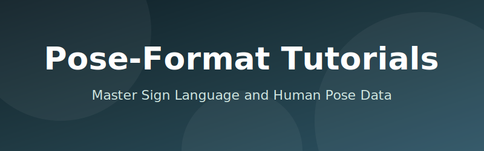

<div align="center">



<p>
  <a href="https://github.com/24-mohamedyehia/pose-format-tutorials/stargazers"></a>
  
  
  <a href="https://github.com/24-mohamedyehia/pose-format-tutorials/blob/main/LICENSE"></a>
</p>

# 📚 pose-format Tutorials

Practical, end-to-end notebooks and examples that teach the `pose-format` library from basics to advanced workflows (conversion, Normalizing Data,Interpolation visualization, augmentation, and web usage). Written for researchers and developers working with sign language and human pose data.

</div>

---

## 🔗 Resources & Recommendations
- **Related project:** [pose](https://github.com/sign-language-processing/pose) — alternative/related `pose` repository for SL processing.
- **Documentation:**  [pose-format Documentation](https://pose-format.readthedocs.io/en/latest/) — full `pose-format` API docs and guides.
- **Paper:**  [pose-format Paper](https://arxiv.org/abs/2310.09066) — academic reference relevant to pose-format research.
- **Editor extension (optional):** For VS Code users, we recommend the `Pose` extension: [Pose Extension](https://marketplace.visualstudio.com/items?itemName=bipinkrish.pose) — adds syntax highlighting and helpers for pose files.

## 📓 Tutorial Notebooks
All notebooks include an Open in Colab badge at the top and a one-line setup cell that installs the lesson-specific packages.

| # | Notebook | Colab | What you learn |
|---|----------|-------|----------------|
| 01 | [01_extract_landmarks_from_video.ipynb](examples/01_extract_landmarks_from_video.ipynb) | [](https://colab.research.google.com/github/24-mohamedyehia/pose-format-tutorials/blob/main/examples/01_extract_landmarks_from_video.ipynb) | Extract landmarks from video with MediaPipe Holistic and save `.pose` files |
| 02 | [02_convert_pose_formats.ipynb](examples/02_convert_pose_formats.ipynb) | [](https://colab.research.google.com/github/24-mohamedyehia/pose-format-tutorials/blob/main/examples/02_convert_pose_formats.ipynb) | Convert `.pose` to JSON/NPZ and back |
| 03 | [03_read_pose_files.ipynb](examples/03_read_pose_files.ipynb) | [](https://colab.research.google.com/github/24-mohamedyehia/pose-format-tutorials/blob/main/examples/03_read_pose_files.ipynb) | Load and slice pose data, work with frames and time ranges |
| 04 | [04_visualize_pose.ipynb](examples/04_visualize_pose.ipynb) | [](https://colab.research.google.com/github/24-mohamedyehia/pose-format-tutorials/blob/main/examples/04_visualize_pose.ipynb) | Render videos, GIFs, and images from pose data |
| 05 | [05_Normalization.ipynb](examples/05_Normalization.ipynb) | [](https://colab.research.google.com/github/24-mohamedyehia/pose-format-tutorials/blob/main/examples/05_Normalization.ipynb) | Normalize pose data for consistency across videos |
| 06 | [06_Augmentation.ipynb](examples/06_Augmentation.ipynb) | [](https://colab.research.google.com/github/24-mohamedyehia/pose-format-tutorials/blob/main/examples/06_Augmentation.ipynb) | Apply data augmentation techniques (rotation, zoom, skew, etc.) |
| 07 | [07_Interpolate.ipynb](examples/07_Interpolate.ipynb) | [](https://colab.research.google.com/github/24-mohamedyehia/pose-format-tutorials/blob/main/examples/07_Interpolate.ipynb) | Interpolate missing frames and smooth pose sequences |
| 08 | [08_advanced_features.ipynb](examples/08_advanced_features.ipynb) | [](https://colab.research.google.com/github/24-mohamedyehia/pose-format-tutorials/blob/main/examples/08_advanced_features.ipynb) | Advanced features and techniques for pose data manipulation |

## 📋 Prerequisites
- Python 3.11
- `ffmpeg` available on PATH for video handling (recommended)
- GPU optional for deep learning examples

## 🚀 If You Want to Work Locally
1. Create and activate a conda environment. Install Python package manager (Miniconda) skip this step if you already have it installed.
 - Download and install MiniConda from [here](https://www.anaconda.com/download/success)

1. Open a terminal and run the following commands:
```bash
git clone https://github.com/24-mohamedyehia/pose-format-tutorials.git
cd pose-format-tutorials
conda create -n pose-format-tutorials python=3.11 -y
conda activate pose-format-tutorials
python -m pip install -r requirements.txt
```
3. Go to First Jupyter Notebook. Good luck and have fun! 🚀

## 🤝 Contributing
Issues and pull requests are welcome to expand coverage, fix bugs, or improve examples.

## 📜 License
This project is licensed under the MIT License - see the [LICENSE](LICENSE) file for details.
